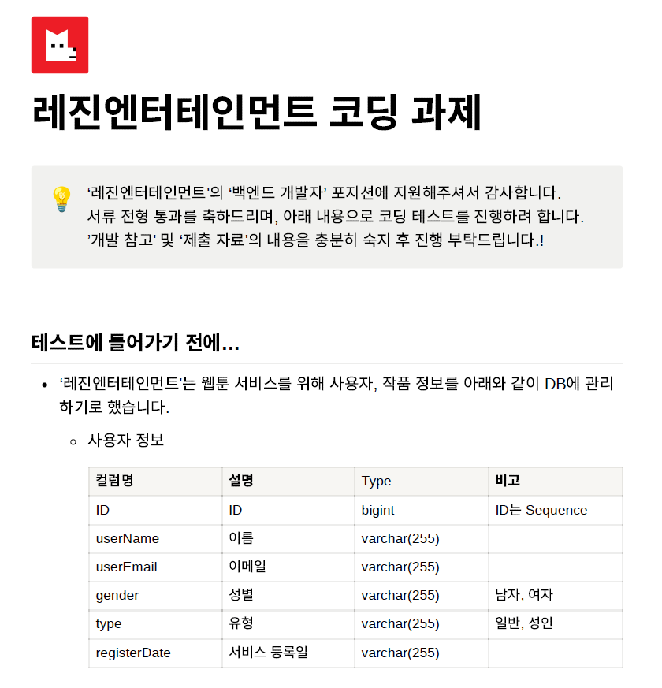
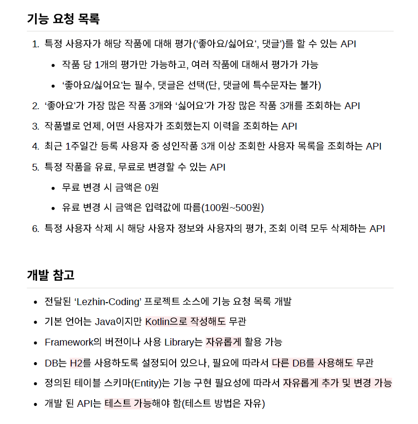

# Lezhin-Coding

## 기술 스택

다음은 이 프로젝트에서 사용된 주요 기술 스택입니다.

- **백엔드:** Java, Spring Boot, IntelliJ, Gradlew, JPA, QueryDSL
- **데이터베이스:** H2
- **버전 관리:** Git
- **기타:** RESTful API, JWT 인증
- **테스트 툴:** IntelliJ http, JUnit

